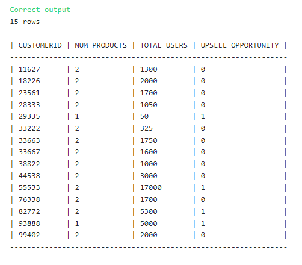

## Creating Binary Columns with CASE


### The Solution: 

``` SQL
-- SQL request(s)​​​​​​‌​‌​​‌‌​​​‌‌‌‌​​​​​​‌​‌‌‌ below
select 
customerid,
count(productid) as num_products,
sum(numberofusers) as total_users,
case when sum(numberofusers) > 5000 OR count(productid) = 1 then 1
else 0
end as upsell_opportunity
from subscriptions
group by customerid
```

### Solution Screenshot:


