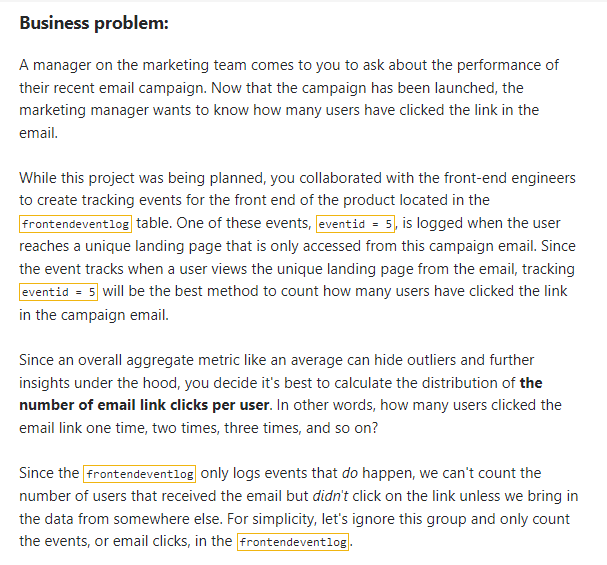
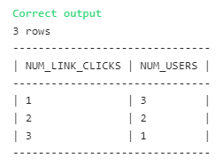

## Exploring variable distributions with CTEs



### The Solution: 

``` SQL
-- SQL request(s)​​​​​​‌​‌​​‌‌​​​‌‌‌‌​​​​​​‌​‌‌‌ below
with click_links as (
select 
userid, count(EVENTID) as num_link_clicks
from 
frontendeventlog
where eventid = 5
group by userid)

select 
num_link_clicks, count(userid) as num_users
from click_links
group by num_link_clicks
```

### Solution Screenshot:


