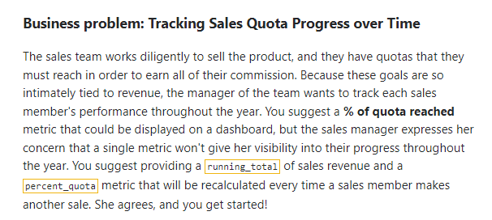
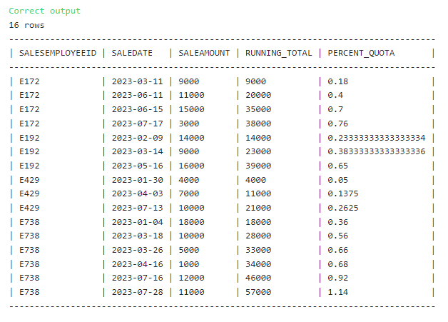

## Tracking Running Totals with Window Functions



### The Solution: 

``` SQL
-- SQL request(s)​​​​​​‌​‌​​‌‌​​​‌‌‌‌​​​​​​‌​‌‌‌ below
select 
salesemployeeid,
saledate,
saleamount,
sum(SALEAMOUNT) over (partition by salesemployeeid order by saledate) as Running_total,
 cast(sum(SALEAMOUNT) over (partition by salesemployeeid order by saledate) as float) / quota as percent_quota
from
Sales as s
join
Employees as e
on 
s.SALESEMPLOYEEID = e.EMPLOYEEID
order by salesemployeeid, saledate
```

### Solution Screenshot:


