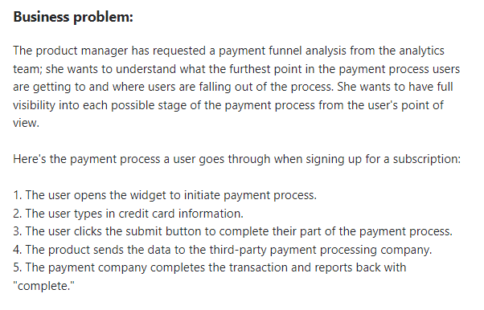
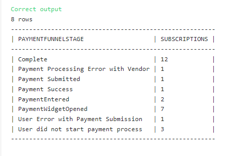

## Payment funnel analysis with multiple CTEs



### The Solution: 

``` SQL
-- SQL request(s)​​​​​​‌​‌​​‌‌​​​‌‌‌‌​​​​​​‌​‌‌‌ below
with maxstatus_reached as (
SELECT
subscriptionid, max(statusid) as maxstatus
from paymentstatuslog
group by subscriptionid
),
paymentfunnelstages as (
select s.subscriptionid,
case when maxstatus = 1 then 'PaymentWidgetOpened'
		when maxstatus = 2 then 'PaymentEntered'
		when maxstatus = 3 and currentstatus = 0 then 'User Error with Payment Submission'
		when maxstatus = 3 and currentstatus != 0 then 'Payment Submitted'
		when maxstatus = 4 and currentstatus = 0 then 'Payment Processing Error with Vendor'
		when maxstatus = 4 and currentstatus != 0 then 'Payment Success'
		when maxstatus = 5 then 'Complete'
		when maxstatus is null then 'User did not start payment process'
		end as paymentfunnelstage
	from subscriptions s
	left join maxstatus_reached m
	on s.subscriptionid = m.subscriptionid
)

select paymentfunnelstage, count(SUBSCRIPTIONID) as subscriptions from
paymentfunnelstages
group by paymentfunnelstage;
```

### Solution Screenshot:


