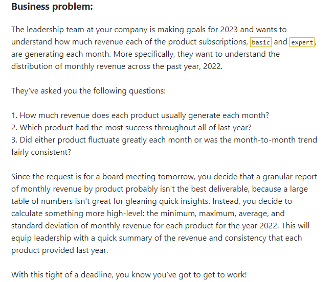
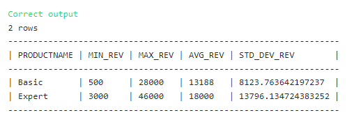

## Calculating descriptive statistics for monthly revenue by product



### The Solution: 

``` SQL
-- SQL request(s)​​​​​​‌​‌​​‌‌​​​‌‌‌‌​​​​​​‌​‌‌‌ below
with monthly_revs as (
select 
date_trunc('month',s.orderdate) as ordermonth,
p.productname,
sum(s.revenue) as revenue
from 
subscriptions as s
join
products as p
on s.productid = p.productid
where
s.orderdate between '2022-01-01' and '2022-12-31'
group by 
date_trunc('month', s.orderdate), p.productname
)

SELECT 
productname,
MIN(revenue) as min_rev, 
MAX(revenue) as max_rev, 
AVG(revenue) as avg_rev, 
stddev(revenue) as std_dev_rev
FROM
monthly_revs
GROUP BY ProductName
```

### Solution Screenshot:


