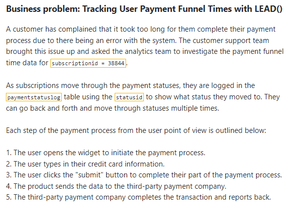
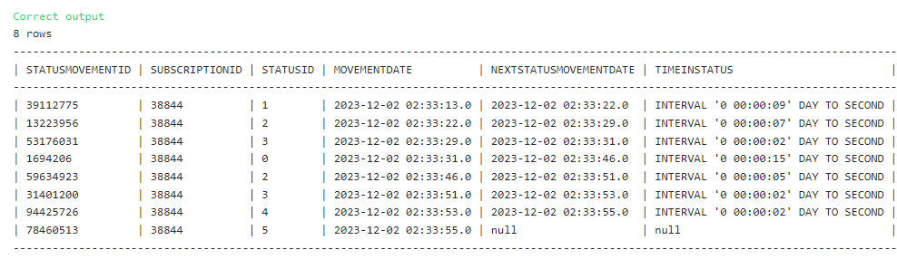

## Consecutive Timestamp Differences with LEAD()



### The Solution: 

``` SQL
-- SQL request(s)​​​​​​‌​‌​​‌‌​​​‌‌‌‌​​​​​​‌​‌‌‌ below
select 
statusmovementid,
subscriptionid,
statusid,
movementdate,
lead(movementdate,1) over(partition by subscriptionid order by movementdate) as nextstatusmovementdate,
lead(movementdate,1) over(partition by subscriptionid order by movementdate) - movementdate as timeinstatus
from
paymentstatuslog
where subscriptionid = '38844';
```

### Solution Screenshot:


