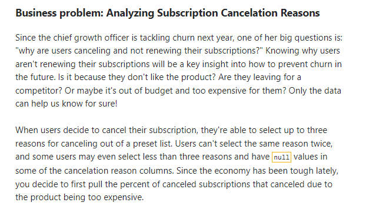
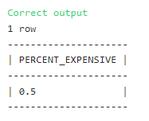

## Unpivoting columns into rows using UNION



### The Solution: 

``` SQL
-- SQL request(s)​​​​​​‌​‌​​‌‌​​​‌‌‌‌​​​​​​‌​‌‌‌ below
with all_cancelation_reasons as(

select subscriptionid, cancelationreason1 as cancelationreason
from cancelations
UNION
select subscriptionid, cancelationreason2 as cancelationreason
from cancelations
UNION
select subscriptionid, cancelationreason3 as cancelationreason
from cancelations
)

select 
    cast(count(
        case when cancelationreason = 'Expensive' 
        then subscriptionid end) as float)
    /count(distinct subscriptionid) as percent_expensive
from    
    all_cancelation_reasons
```

### Solution Screenshot:


