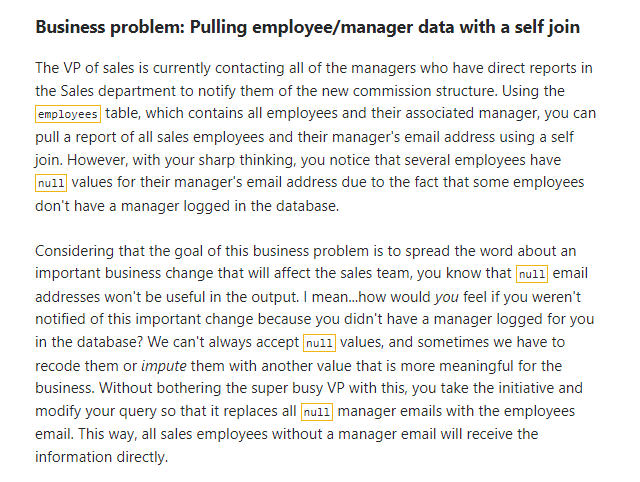
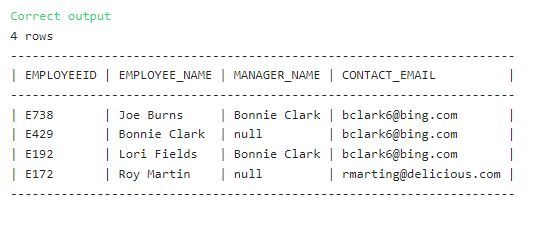

## Combining Multiple Tables Using UNION (Using self joins to pull hierarchical relationships)



### The Solution: 

``` SQL
-- SQL request(s)​​​​​​‌​‌​​‌‌​​​‌‌‌‌​​​​​​‌​‌‌‌ below
select 
employees.EMPLOYEEID,
employees.NAME as Employee_name,
manager.name as Manager_name,
coalesce(manager.email, employees.email) as contact_email
from 
employees 
left join
employees as Manager
on employees.managerid = manager.employeeid
where employees.DEPARTMENT = 'Sales'
```

### Solution Screenshot:


